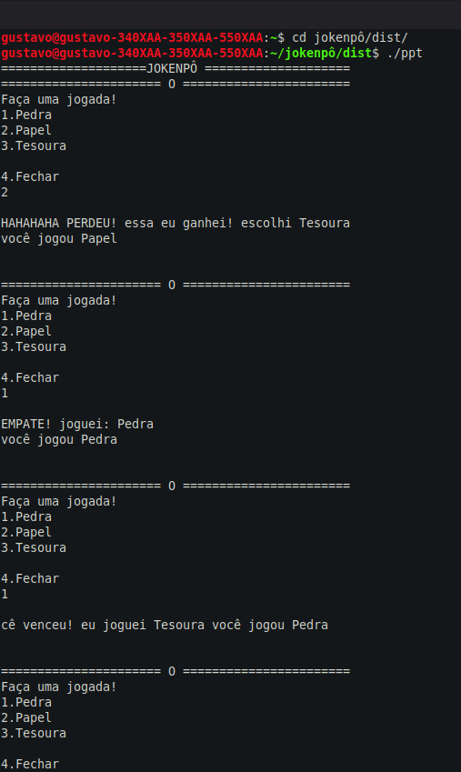

# executavel


# 🪨📄✂️ Jokenpô (Pedra, Papel, Tesoura)

Jogo clássico de Pedra, Papel e Tesoura desenvolvido em Python. Jogue contra o computador e teste sua sorte!

---

## 🎮 Como jogar

Execute o programa e escolha:
- `1` para **Pedra** 🪨
- `2` para **Papel** 📄
- `3` para **Tesoura** ✂️

O computador fará sua escolha aleatória e o vencedor será anunciado!

---

## 🚀 Como executar
### Opção 1: Executar com Python (recomendado para todos)
Se você tem Python instalado, execute o código fonte:

```bash
# Clone o repositório
git clone https://github.com/amoras200/jokenpo.git
cd jokenpo

# Execute o script
python3 ppt.py

# ou

python ppt.py
```

### Opção 2: Executável pré-compilado (Linux Mint / Ubuntu)
Se você estiver no **Linux Mint** ou **Ubuntu**, pode executar diretamente:

```bash
cd jokenpo/dist
chmod +x ppt
./ppt
```
# Divirta-se



